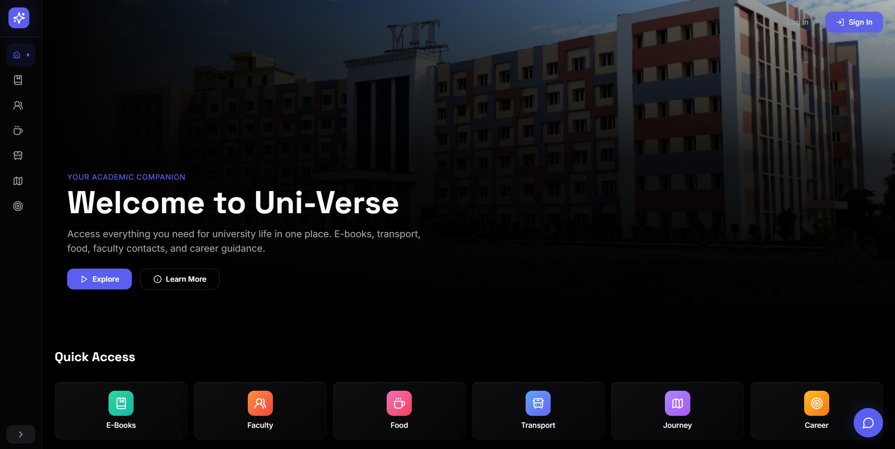
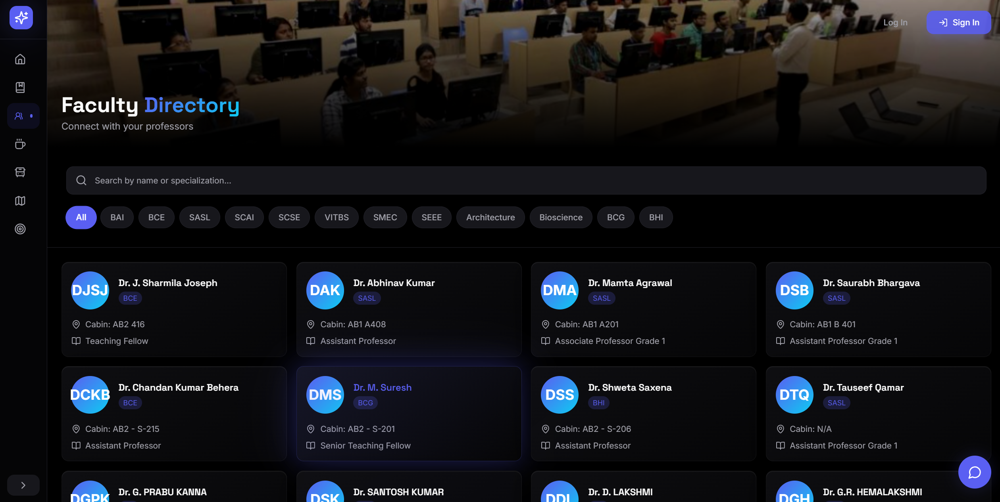

<div align="center">
  
  
  <br />
  
  # 🎓 Uni-Verse
  
  **Your Academic Super-App. Reimagining the University Experience.**
  
  [](https://uni-verse-swart.vercel.app/)
  []()
  []()
  []()
  
</div>

---

## 🚀 Overview

**Uni-Verse** was born from a simple observation: student life is fragmented. Between checking bus schedules, finding library books, looking up faculty contacts, and figuring out what's for lunch, students waste valuable time navigating specific, disconnected systems. 

We built Uni-Verse to be a single, beautifully designed interface that brings everything you need onto one screen. 

**🔗 [Access the Live App Here](https://uni-verse-swart.vercel.app/)**

---

## ✨ Features



- 📚 **E-Books & Academic Hub:** Seamlessly access your digital library and study materials.
- 🧑‍🏫 **Faculty Directory:** Instantly find and connect with your professors.
- 🍔 **Campus Food Court:** Check today's specials and discover what's hot right now.
- 🚌 **Transport Hub:** Keep track of live bus schedules and book cabs instantly.
- 🎓 **Student Journey:** Monitor your academic milestones and roadmap.
- 💼 **Career Hub:** Explore placement predictors, analytics, and career resources.

---

## 🛠️ Tech Stack

Built for speed and aesthetic excellence:

| Technology | Purpose |
|------------|----------|
| **React + TypeScript** | Robust, scalable frontend architecture |
| **Vite** | Lightning-fast build tooling and HMR |
| **Tailwind CSS** | Highly customized, modern glassmorphism UI |
| **Framer Motion** | Smooth, professional animations and transitions |
| **Lucide Icons** | Beautiful, modern iconography |

---

## ⚙️ Getting Started

To run Uni-Verse locally on your machine:

### 1. Clone the repository
```bash
git clone https://github.com/m4n1kya/Uni-Verse.git
```

### 2. Navigate to the project
```bash
cd Uni-Verse
```

### 3. Install dependencies
```bash
npm install
```

### 4. Run the development server
```bash
npm run dev
```

The application will be instantly available at `http://localhost:5173`.

---

## 🔮 Future Enhancements

- **Secure Authentication System**
- **Personalized Student Dashboard (CGPA tracking, Timetables)**
- **AI-Powered Campus Assistant Chatbot**
- **Real-time Notifications**

---

## 👨‍💻 Author

**Manikya N**

GitHub: [m4n1kya](https://github.com/m4n1kya)

<br/>
<div align="center">
  <i>If you found this project useful or aesthetically pleasing, consider giving it a ⭐!</i>
</div>